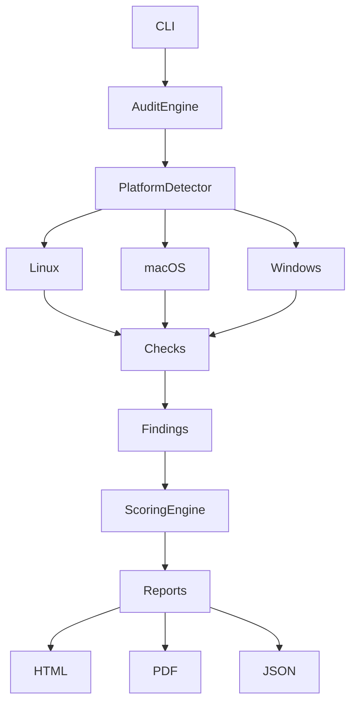

# HostSentinel

<p align="center">

Cross-Platform Host Security Auditing Framework

Automated Security Assessments • Host Hardening • Risk Prioritization • Professional Reporting

</p>

<p align="center">


</p>

---

## Overview

HostSentinel is a cross-platform host security auditing framework that evaluates the security posture of Linux, macOS, and Windows systems through modular security checks, risk prioritization, and professional reporting.

The framework identifies security misconfigurations, insecure services, weak authentication settings, exposed network services, outdated software, persistence mechanisms, and other host-level security issues. It presents findings through structured HTML, PDF, and JSON reports with remediation guidance and supporting evidence.

HostSentinel is designed to demonstrate modern security engineering practices including modular architecture, structured finding models, platform abstraction, and maintainable audit pipelines.

---

## Features

### Security Auditing

- Cross-platform host security assessment
- Automated security posture evaluation
- Security configuration auditing
- Local vulnerability correlation
- Risk prioritization
- Professional remediation guidance

### Platform Support

- Linux
- macOS
- Windows

Platform detection is automatic. HostSentinel executes only the checks applicable to the current operating system.

---

### Reporting

Generate multiple report formats:

- HTML
- PDF
- JSON

Every finding includes:

- Severity
- Internal Risk Score
- Detection confidence
- Technical explanation
- Business impact
- Evidence
- Detection command
- Verification command
- Remediation guidance
- Relevant security references

---

### Modular Architecture

Each security check is implemented independently using a plugin architecture.

Adding a new audit module requires implementing the BaseCheck interface without modifying the audit engine.

This allows HostSentinel to remain easily extensible while keeping the orchestration layer clean.

---

# Architecture



---

# Project Structure

```text
HostSentinel/

├── checks/
│   ├── authentication
│   ├── networking
│   ├── persistence
│   ├── integrity
│   ├── malware
│   └── hardening
│
├── core/
│   ├── audit_engine.py
│   ├── models.py
│   ├── scoring.py
│   └── platform_detection.py
│
├── reports/
│   ├── html_report.py
│   ├── pdf_report.py
│   └── json_report.py
│
├── platforms/
│
├── config/
│
├── utils/
│
├── fixes/
│
└── hostsentinel.py
```

---

# Audit Pipeline

```mermaid
graph LR

Start

-->

Platform Detection

-->

Security Checks

-->

Findings

-->

Risk Scoring

-->

Report Generation

-->

Remediation Guidance
```

---

# Risk Scoring

HostSentinel assigns every finding a severity level and calculates an overall host security score.

The scoring algorithm uses weighted deductions with diminishing penalties to avoid disproportionately lowering scores due to numerous low-severity findings.

| Score | Risk |
|--------|------|
| 80–100 | Healthy |
| 70–79 | Minor Issues |
| 50–69 | Medium Risk |
| 20–49 | Serious Risk |
| 0–19 | Critical |

The score is intended to prioritize remediation efforts and provide an overall view of host security posture.

---

# Included Security Modules

| Check | Description |
|---------|-------------|
| SSH Configuration | SSH daemon hardening and authentication checks |
| Firewall | Firewall state validation |
| Password Policy | Password complexity auditing |
| Open Ports | Listening service enumeration |
| Package Updates | Outdated software detection |
| Package Inventory | Installed software inventory |
| Running Services | Legacy and insecure service detection |
| User Privileges | Privilege escalation opportunities |
| File Permissions | Sensitive file permission auditing |
| File Integrity | Critical file integrity monitoring |
| Scheduled Tasks | Persistence mechanism detection |
| Startup Services | Boot persistence auditing |
| Dangerous Configuration | Hardening validation |
| Rootkit Detection | Rootkit scanner integration |
| Vulnerability Summary | Local CVE correlation |

---

# Installation

Clone the repository

```bash
git clone https://github.com/shouryatuhar/HostSentinel.git

cd HostSentinel
```

Install dependencies

```bash
pip install -r requirements.txt
```

---

# Usage

Run a complete audit

```bash
python hostsentinel.py
```

List available checks

```bash
python hostsentinel.py --list-checks
```

Run selected checks

```bash
python hostsentinel.py -k ssh_config -k firewall
```

Generate HTML and PDF reports

```bash
python hostsentinel.py --format html --format pdf
```

Specify output directory

```bash
python hostsentinel.py -o reports/
```

---

# Example Output

```
Host: MacBook-Air

Overall Score: 82

Platform: macOS

Checks Executed: 18

Findings

Critical : 0

High : 1

Medium : 2

Low : 3

Generated Reports

✓ HTML

✓ PDF

✓ JSON
```

---

# Sample Reports

HostSentinel generates:

- Executive Summary
- Severity Breakdown
- Detailed Findings
- Technical Evidence
- Business Impact
- Remediation Guidance
- Verification Commands

Screenshots

```
docs/screenshots/

cli.png

html-report.png

pdf-report.png
```

---

# Design Decisions

HostSentinel emphasizes:

- Low false-positive detections
- Explainable findings
- Platform abstraction
- Modular architecture
- Professional reporting
- Maintainable code
- Structured security metadata

The project intentionally avoids unnecessary complexity and focuses on producing reliable, explainable security assessments.

---

# Future Improvements

Planned enhancements include:

- Remote host auditing
- Fleet-wide scanning
- Scheduled audits
- Compliance profile support (CIS/NIST)
- SARIF export
- Plugin marketplace
- Centralized dashboard

---

# Contributing

Contributions are welcome.

Please read:

- CONTRIBUTING.md
- CODE_OF_CONDUCT.md
- SECURITY.md

before submitting pull requests.

---

# License

Licensed under the MIT License.

See LICENSE for details.

---

# Acknowledgements

HostSentinel is inspired by the architectural principles and reporting approaches commonly found in host security auditing and vulnerability assessment tools.

The project was developed for educational purposes to explore secure software design, security automation, modular system architecture, and host security assessment techniques.
