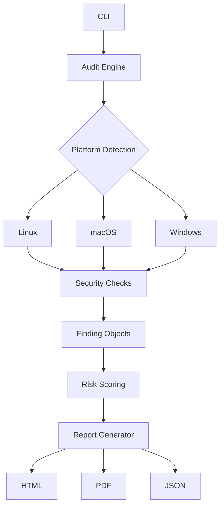
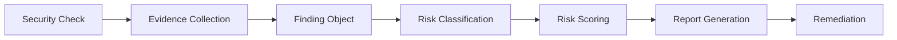

# HostSentinel

<p align="center">


</p>

<p align="center">

<b>Cross-Platform Host Security Auditing Framework</b>

Automated Security Assessments • Host Hardening • Modular Security Checks • Professional Reporting

</p>

<p align="center">


</p>

---

# Overview

HostSentinel is a cross-platform host security auditing framework that evaluates the security posture of Linux, macOS, and Windows systems through modular security checks, structured findings, risk prioritization, and professional reporting.

The framework identifies security misconfigurations, insecure services, weak authentication settings, exposed network services, outdated software, persistence mechanisms, and other host-level security issues.

Rather than functioning as a vulnerability scanner alone, HostSentinel focuses on producing explainable findings supported by technical evidence, remediation guidance, and structured reporting.

The project was built to explore practical security engineering concepts including platform abstraction, modular software architecture, host hardening, security automation, and maintainable audit pipelines.

---

# Key Features

## Host Security Auditing

- Cross-platform host security assessment
- Automated security posture evaluation
- Security configuration auditing
- Risk prioritization
- Structured remediation guidance
- Professional reporting

---

## Supported Platforms

- Linux
- macOS
- Windows

HostSentinel automatically detects the operating system and executes only the security checks applicable to that platform.

---

## Reporting

HostSentinel generates multiple report formats:

- HTML
- PDF
- JSON

Each finding includes:

- Severity
- Internal Risk Score
- Detection Confidence
- Technical Explanation
- Business Impact
- Supporting Evidence
- Detection Command
- Verification Command
- Remediation Guidance
- Security References

---

## Plugin Architecture

Security checks are implemented as modular plugins.

Each module follows a common interface and returns structured Finding objects, allowing new security checks to be added without modifying the audit engine.

This separation keeps the framework maintainable, testable, and easy to extend.

---

# Architecture



---

# Audit Workflow


---

# Project Structure

```text
HostSentinel
│
├── checks/              # Security audit modules
├── core/                # Audit engine, models, scoring
├── reports/             # HTML, PDF and JSON report generation
├── platforms/           # Platform-specific registration
├── config/              # Configuration management
├── utils/               # Helpers and utilities
├── fixes/               # Optional remediation modules
├── docs/                # Documentation and screenshots
├── tests/               # Unit tests
│
└── hostsentinel.py      # Application entry point
```

---

# Security Modules

| Category | Checks |
|----------|---------|
| Authentication | SSH Configuration, Password Policy, User Privileges, Unused Accounts |
| Networking | Firewall, Open Ports, Port Scan |
| Malware | Suspicious Processes, Rootkit Detection |
| Persistence | Scheduled Tasks, Startup Services |
| Integrity | File Integrity, File Permissions |
| Hardening | Dangerous Configuration |
| Inventory | Package Inventory |
| Patch Management | Outdated Packages |
| Reporting | Vulnerability Summary |

---

# Finding Lifecycle



---

# Risk Scoring

HostSentinel assigns each finding a severity level and calculates an overall host security score.

The scoring model uses weighted deductions with diminishing penalties to better represent overall system security while preventing numerous minor issues from disproportionately reducing the final score.

| Score | Security Posture |
|--------|------------------|
| 80 – 100 | Healthy |
| 70 – 79 | Minor Issues |
| 50 – 69 | Moderate Risk |
| 20 – 49 | High Risk |
| 0 – 19 | Critical Risk |

The score is intended to help prioritize remediation efforts and provide a quick overview of host security posture.

---

# Installation

Clone the repository

```bash
git clone https://github.com/shouryatuhar/HostSentinel.git

cd HostSentinel
```

Install dependencies

```bash
pip install -r requirements.txt
```

---

# Usage

Run a complete audit

```bash
python hostsentinel.py
```

List available security modules

```bash
python hostsentinel.py --list-checks
```

Run selected checks

```bash
python hostsentinel.py -k ssh_config -k firewall
```

Generate reports

```bash
python hostsentinel.py --format html --format pdf --format json
```

Specify report directory

```bash
python hostsentinel.py -o reports/
```

---

# Example Output

```text
Host: MacBook Pro

Platform: macOS

Overall Score: 82

Checks Executed: 18

Findings

Critical : 0

High : 1

Medium : 2

Low : 3

Reports Generated

✓ HTML

✓ PDF

✓ JSON
```

---

# Screenshots

## Command Line


---

## HTML Report


---

## PDF Report


---

# Design Principles

HostSentinel was designed around several engineering principles:

- Modular architecture
- Platform abstraction
- Explainable findings
- Low false-positive detections
- Maintainable codebase
- Structured reporting
- Separation of concerns
- Extensible plugin model

The project intentionally favors reliable detections and clear reporting over maximizing the number of implemented security checks.

---

# Roadmap

Future improvements may include:

- Remote host auditing
- Fleet-wide endpoint scanning
- Compliance profiles (CIS / NIST)
- Scheduled scans
- SARIF export
- REST API
- SIEM integration

---

# Contributing

Contributions are welcome.

Please read:

- CONTRIBUTING.md
- SECURITY.md
- CODE_OF_CONDUCT.md

before submitting a pull request.

---

# License

Licensed under the MIT License.

See the LICENSE file for details.

---

# Disclaimer

HostSentinel is an educational and open-source security engineering project developed to explore host security auditing, software architecture, and security automation concepts.

It is not intended to replace commercial vulnerability assessment or endpoint detection platforms.

---

# Author

**Shourya Tuhar**

Computer Science (Cyber Security)

GitHub: https://github.com/shouryatuhar
